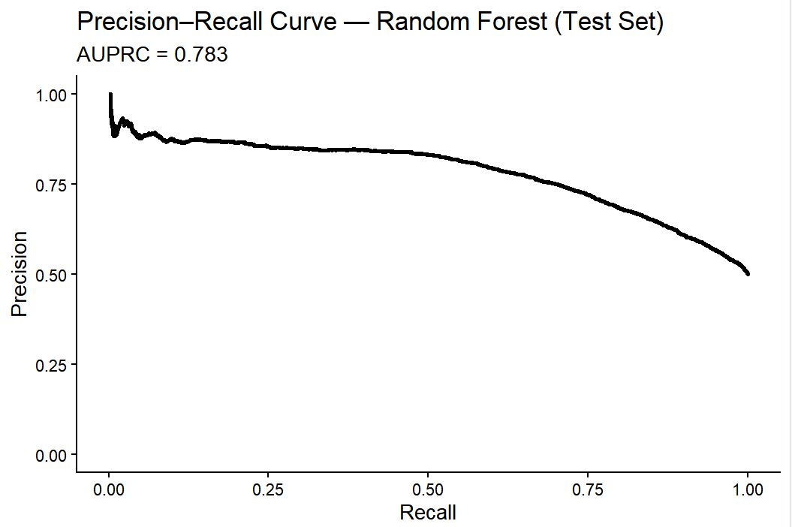
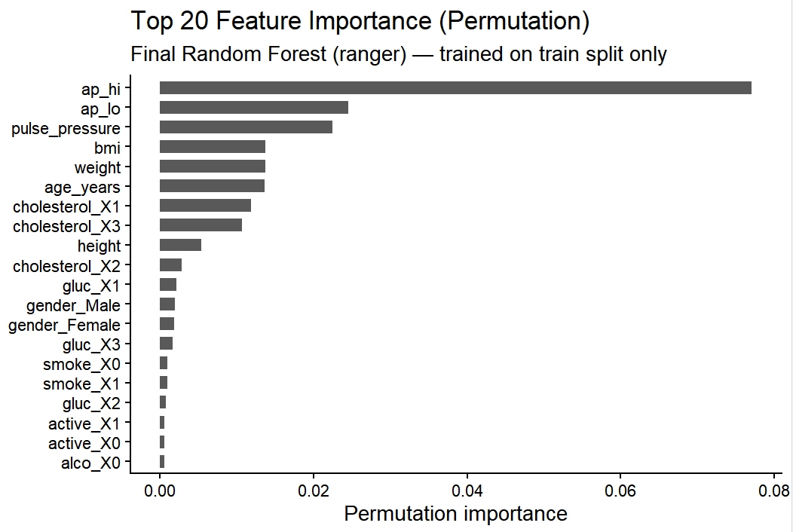
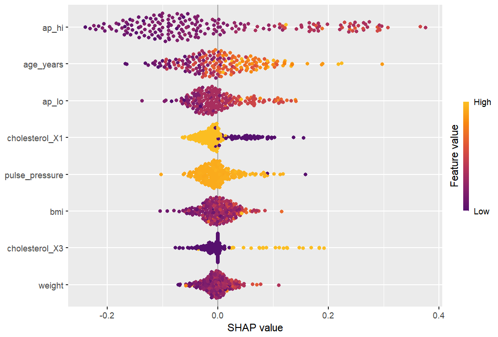

# CVDprediction: An R Package for Cardiovascular Disease Prediction
A reproducible, user-friendly R package to preprocess tabular heart disease data, train random forest models, and generate CVD (Cardiovascular Disease) predictions—aligned with BIO215 course project requirements.

## Overview
CVDprediction simplifies the end-to-end workflow for cardiovascular disease prediction using machine learning. It addresses key challenges in medical data analysis:

The package provides:
- Prevents data leakage through training-only preprocessing
- Implements reproducible model training with cross-validation
- Provides clinically relevant evaluation metrics (AUROC, AUPRC, feature importance)
- Supports both direct R usage and integration with Shiny apps
- Follows R package best practices with full Roxygen2 documentation

---
## Dataset
The package is built around the publicly available Risk Factors for Cardiovascular Heart Disease Dataset (hosted on Kaggle by Kuzak Dempsy), containing over 70,000 samples of adult health metrics.

The dataset includes 14 features (clinical & demographic measurements) and a binary target variable:
Features: age (days), gender, height, weight, ap_hi (systolic blood pressure), ap_lo (diastolic blood pressure), cholesterol, gluc (glucose level), smoke, alco, active

## Installation

### Before installation, ensure that the dependency package is installed
```r
install.packages("devtools")    # or: install.packages("remotes"). # or: install.packages("randomForest")
```
### Install CVDprediction from GitHub
You can install the package from GitHub using remotes or devtools:
```r
devtools::install_github("ZihanHe-xjtlu/cvdPrediction")
library(cvdPrediction)
```

```r
remotes::install_github("ZihanHe-xjtlu/cvdPrediction") 
library(cvdPrediction)
```
---
## Example Usage

### Data Preprocessing
```r
set.seed(42) 
preprocess_res <- preprocess_heart_data(
  data_path = system.file("extdata", "heart_data.csv", package = "cvdPrediction")
)

head(preprocess_res$cleaned_data)  # Full cleaned dataset

```
### Model Trainings
```r
set.seed(42)
cvd_model <- train_cvd_rf(
  cleaned_data = preprocess_res$cleaned_data,
  cv_folds = 5,    
  num_trees = 400  
)

cvd_model$model$bestTune
```

### Prediction
```r
set.seed(42)
new_patient <- tibble::tibble(
  age = 25000,  # ~68 years (converted to years automatically)
  gender = 2,   # 1=Female, 2=Male
  height = 175, # cm
  weight = 80,  # kg
  ap_hi = 140,  # Systolic BP
  ap_lo = 90,   # Diastolic BP
  cholesterol = 2,  # Above normal
  gluc = 1,     # Normal
  smoke = 0,    # Non-smoker
  alco = 0,     # Non-drinker
  active = 1    # Physically active
)

# Preprocess & predict
pred_result <- predict_cvd(
  model_obj = cvd_model,
  new_data = new_patient
)

print(pred_result)
```

### Model Evaluation
```r
set.seed(42)
eval_res <- evaluate_cvd_model(model_obj = cvd_model)

cat("Test Set AUROC:", round(eval_res$auroc, 3), "\n")
cat("Test Set AUPRC:", round(eval_res$auprc, 3), "\n")
print(eval_res$confusion_matrix)  

eval_res$roc_curve_plot 
```
---
## Model Performance
Our core Random Forest model demonstrates strong discriminative power for CVD risk prediction, validated on an independent test set:
### 1. ROC Curve

ROC curve with AUROC 0.797: Strong ability to distinguish CVD cases

### 2. Precision-Recall Curve

PRC curve with AUPRC 0.783: Reliable for imbalanced clinical screening.

### 3. Top 20 Permutation Importance

Key predictors: Systolic BP (ap_hi), diastolic BP (ap_lo), pulse pressure (clinically validated).

### 4. SHAP Beeswarm Plot (Top 8 Features)

SHAP values: Positive = increased CVD risk (e.g., high ap_hi/age), negative = decreased risk.
---
## License

MIT License
---
## Citation
If you use this package in articles, please cite:
Zihan He. (2025)   cvdPrediction – CVDprediction: An R Package for Cardiovascular Disease Prediction. GitHub: ZihanHe-xjtlu/cvdPrediction
---
## Contact
https://github.com/ZihanHe-xjtlu/cvdPrediction/issues
